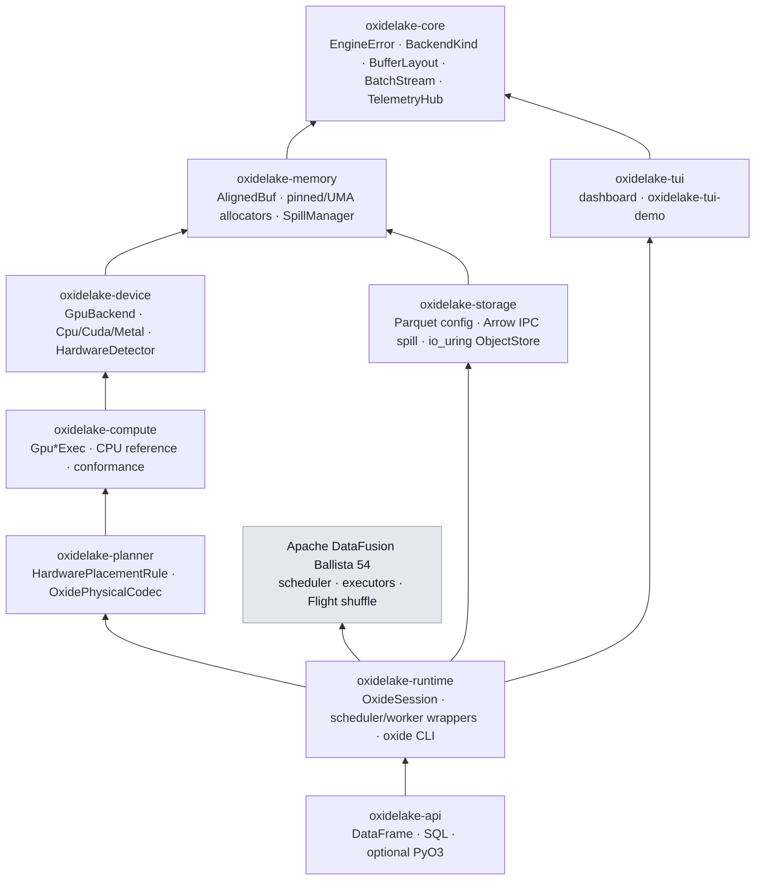
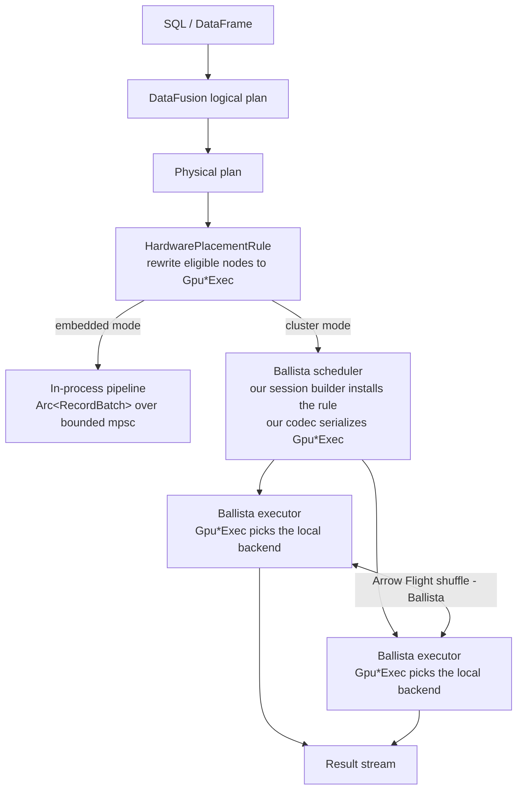
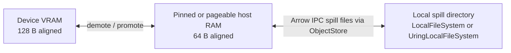

# Architecture

Authoritative detail lives in [SPEC.md §2–§3](SPEC.md). This page is the map.

## Crates and dependency direction

Arrows point from a crate to what it depends on. The graph must stay acyclic. Grey nodes are external.



## Execution flow



Placement is a **physical optimizer rule**, not an AST pass: eligibility depends on physical operator shape and resolved types ([ADR-0010](decisions/ADR-0010-placement-as-physical-optimizer-rule.md)). Anything outside the bounded v1 GPU coverage stays on CPU. In cluster mode the rule runs on the scheduler against the declared cluster capability (`OXIDE_CLUSTER_BACKEND`); each `Gpu*Exec` then selects the *real* local backend at execute time, so a heterogeneous cluster stays correct ([ADR-0013](decisions/ADR-0013-cluster-mode-on-ballista.md)).

## Bounded v1 GPU coverage

| Operator | GPU-eligible shape | Otherwise |
|---|---|---|
| filter + project | `=, <, <=, >, >=` combined with `AND` over Int64/Float64 vs literals; column selection; stream-compacted output | CPU |
| hash join | inner join, single Int64 key; open-addressing table built with atomic CAS, probed in parallel | CPU |
| aggregate | SUM/COUNT/MIN/MAX over Int64/Float64, one low-cardinality Int64 key | CPU |
| vector distance | L2 and cosine, query vector vs `FixedSizeList<Float32>` column | CPU |

CUDA implements all four; Metal implements filter + project and vector distance in v1.

## Memory model and spill tiers



- Every in-memory table is an Arrow `RecordBatch`; host buffers are 64-byte aligned, device-bound buffers 128-byte aligned.
- With CUDA active, host buffers are page-locked (DMA without staging copies); otherwise `AlignedBuf`. The path taken is observable as `MemoryClass::{Pinned, Pageable}`.
- On Apple Silicon, `MTLResourceStorageModeShared` buffers give CPU and GPU one physical allocation.
- `SpillManager` holds per-tier budgets, demotes cold batches on high-watermark pressure, promotes on access, and exports metrics to the TUI. On a GPU-less machine the device tier is empty and the host ↔ disk path is fully testable.

## Hardware abstraction

`Arc<dyn GpuBackend>` is selected at startup by `HardwareDetector` (CUDA → Metal → CPU, overridable with `OXIDE_BACKEND`). The trait is object-safe and synchronous; asynchrony lives on device streams ([ADR-0005](decisions/ADR-0005-object-safe-sync-gpubackend.md)). `CpuBackend` is always present and fully functional — it is the semantic reference the GPU backends must match in the conformance suite.

Kernels ship as source: `.cu` compiled at runtime with NVRTC (PTX cached per device), `.metal` compiled with `newLibraryWithSource`. No `nvcc`, no Xcode step ([ADR-0003](decisions/ADR-0003-cudarc-dynamic-loading-nvrtc.md), [ADR-0004](decisions/ADR-0004-objc2-metal-target-gated.md)).

## Storage

There is no private file format ([ADR-0014](decisions/ADR-0014-parquet-and-arrow-ipc-not-a-custom-format.md)).

```mermaid
flowchart LR
  pq[Parquet lake data<br/>statistics · page index · Bloom filters] --> df[DataFusion Parquet scan<br/>prunes row groups and pages]
  df --> os[object_store::ObjectStore<br/>LocalFileSystem | UringLocalFileSystem]
  spill[SpillManager] <-->|Arrow IPC, 64 B aligned, no decode| os
  os --> nvme[(Local NVMe)]
```

- Lake data is Parquet through DataFusion's listing tables; `oxidelake-storage` owns the writer properties (row-group size, dictionaries, Bloom filters on keys, page statistics), the session pruning settings, and the tests that prove pruning happened via scan metrics while results stay identical.
- Spill files and the optional hot cache are Arrow IPC: raw Arrow buffers, zero decode.
- The io_uring fast path is an `ObjectStore` implementation behind the `io-uring` feature; both stores pass one conformance test ([ADR-0007](decisions/ADR-0007-io-uring-crate-dedicated-thread.md)).

## Telemetry and TUI

`TelemetryHub` (in `oxidelake-core`) is the only coupling between engine and dashboard; in v1 it observes the local process only. The TUI is a state machine with a pure `render(state, frame)`; repaints are bracketed in DEC 2026 synchronized updates. Four panels: Plan DAG with hardware tags, Inspector, Telemetry gauges, Describe (P25/P50/P99). Tested two ways: in-process with `ratatui::backend::TestBackend` + `insta`, and end-to-end with `termlens` driving the deterministic `oxidelake-tui-demo` binary in a real PTY ([ADR-0011](decisions/ADR-0011-tui-testing-layers.md)).

## Out of scope for v1

GPUDirect Storage / cuFile and GPU-side Parquet decode · tuning Ballista's retry or AQE behaviour · TLS/auth for the Ballista cluster · catalog/metastore (Iceberg, Delta) · transactions · cost-based optimization beyond DataFusion defaults · Lance integration (v2) · cluster-wide telemetry in the TUI · Windows.
